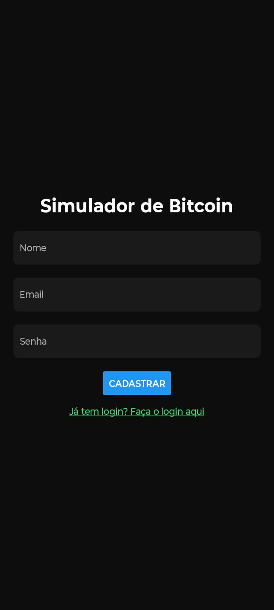
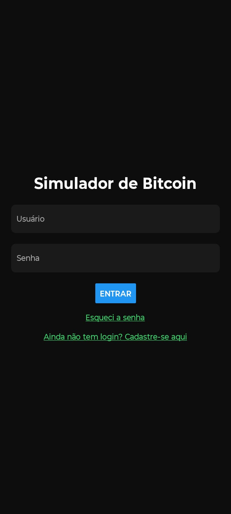
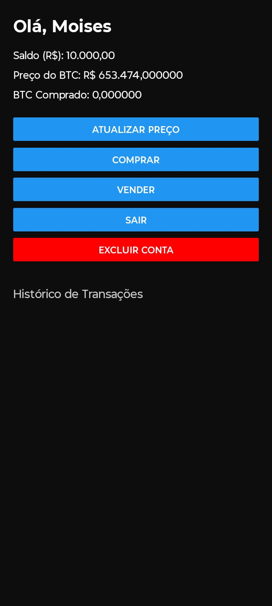

# 💰 Simulador de Bitcoin
Aplicativo mobile desenvolvido com **React Native + Expo**, que simula a compra e venda de Bitcoin de forma educativa. O projeto possui funcionalidades de login, cadastro, redefinição de senha e gerenciamento de saldo virtual em reais e BTC.
---
## 🧩 Funcionalidades
- ✅ Cadastro e login de usuários
- 🔐 Redefinição de senha
- 📊 Visualização do saldo em R$ e BTC
- 🟢 Compra e 🔴 venda simulada de Bitcoin
- 📈 Cotação em tempo real via API CoinGecko
- 🧾 Histórico de transações
- 👤 Armazenamento local com `AsyncStorage`
- 🚪 Logout e exclusão de conta
---
## 🖼️ Capturas de Tela
| Tela de Cadastro | Tela de Login | Tela de Redefinir Senha |
|------------------|---------------|--------------------------|
|  |  |  |
| Tela Principal | Histórico de Transações |
|----------------|-------------------------|
|  |  |
> ⚠️ Certifique-se de colocar suas imagens na pasta `./assets/screens` com os nomes corretos.
---
## 🚀 Tecnologias Utilizadas
### 🧱 Base do Projeto
- [React Native](https://reactnative.dev/)
- [Expo SDK 53](https://docs.expo.dev/)
- [TypeScript](https://www.typescriptlang.org/)
### 📦 Bibliotecas e Dependências
- [`expo`](https://docs.expo.dev/)
- [`axios`](https://axios-http.com/) – requisições HTTP
- [`@react-navigation/native`](https://reactnavigation.org/)
- [`@react-navigation/native-stack`](https://reactnavigation.org/docs/native-stack-navigator/)
- [`@react-native-async-storage/async-storage`](https://docs.expo.dev/versions/latest/sdk/async-storage/)
- [`react-native-screens`](https://github.com/software-mansion/react-native-screens)
- [`react-native-safe-area-context`](https://github.com/th3rdwave/react-native-safe-area-context)
- [`react-native-gesture-handler`](https://docs.swmansion.com/react-native-gesture-handler/)
- [`react-native-reanimated`](https://docs.swmansion.com/react-native-reanimated/)
---
## 🌐 API de Cotação
A cotação do Bitcoin é obtida em tempo real por meio da [CoinGecko API](https://www.coingecko.com/pt/api):
```typescript
const API_URL = "https://api.coingecko.com/api/v3/simple/price?ids=bitcoin&vs_currencies=brl";
```
Exemplo de resposta:
```json
{
  "bitcoin": {
    "brl": 350000
  }
}
```
> ⚠️ A CoinGecko impõe limites de requisição por IP. Caso receba erro 429 (Too Many Requests), aguarde 30-60 segundos antes de novas tentativas.
---
## 🛠️ Pré-requisitos
Antes de executar, instale:
- [Node.js](https://nodejs.org/) (v18+ recomendada)
- [Expo CLI](https://docs.expo.dev/get-started/installation/):
  ```bash
  npm install -g expo-cli
  ```
---
## ▶️ Executando o Projeto
### Passo a Passo
1. **Clonar o repositório:**
```bash
git clone https://github.com/seu-usuario/simulador-bitcoin.git
cd simulador-bitcoin
```
2. **Instalar dependências:**
```bash
npm install
# ou
yarn install
```
3. **Iniciar o servidor de desenvolvimento:**
```bash
npx expo start
```
### Opções de Execução após iniciar o Expo:
- **Android Emulator:** Pressione `a` no terminal  
- **iOS Simulator:** Pressione `i` no terminal  
- **Dispositivo físico:**  
  1. Instale o app [Expo Go](https://expo.dev/client)  
  2. Escaneie o QR code exibido no terminal com a câmera do celular
### Comandos Adicionais Úteis
| Comando | Descrição |
|---------|-----------|
| `npm run android` | Executa diretamente no Android emulator |
| `npm run ios` | Executa diretamente no iOS simulator |
| `npx expo start --clear` | Reinicia o bundler limpando o cache |
| `npx expo prebuild` | Gera código nativo para customização |
---
## 🧱 Estrutura de Arquivos
Principais diretórios:
```
/src
  /assets
  /components
  /contexts
  /screens
  /services
  /types
  /utils
```
---
## 🤝 Contribuindo
1. Faça um fork do projeto
2. Crie uma branch (`git checkout -b feature/nova-feature`)
3. Faça commit das alterações (`git commit -m 'Adiciona nova feature'`)
4. Push para a branch (`git push origin feature/nova-feature`)
5. Abra um Pull Request
---
## 📄 Licença
Este projeto está sob a licença MIT. Consulte o arquivo [LICENSE](LICENSE) para detalhes.
---
> Desenvolvido com ❤️ por [Moisés](https://github.com/seu-usuario)  
> Atualizado em: 25 de Julho de 2025
```

